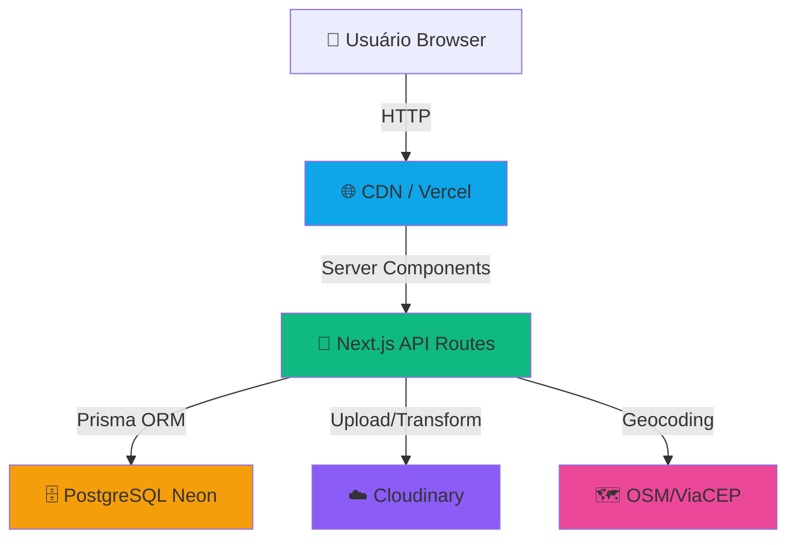
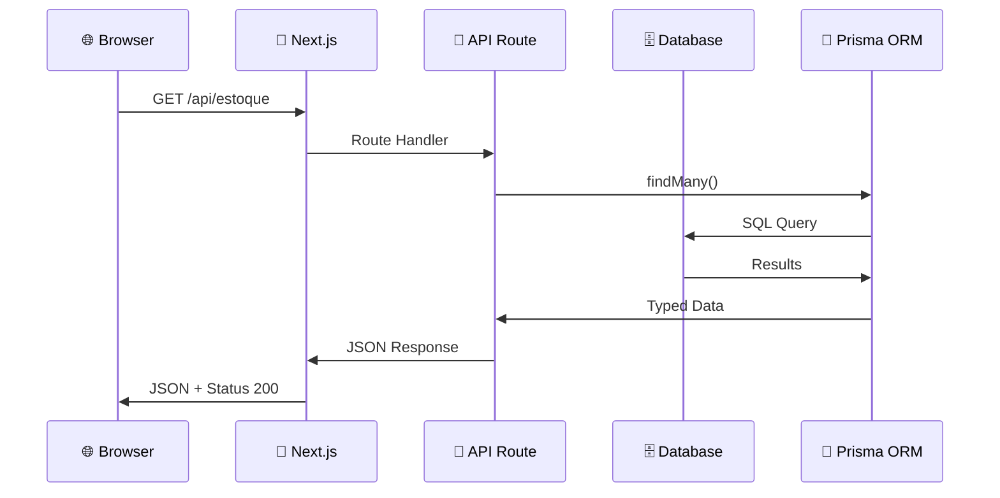
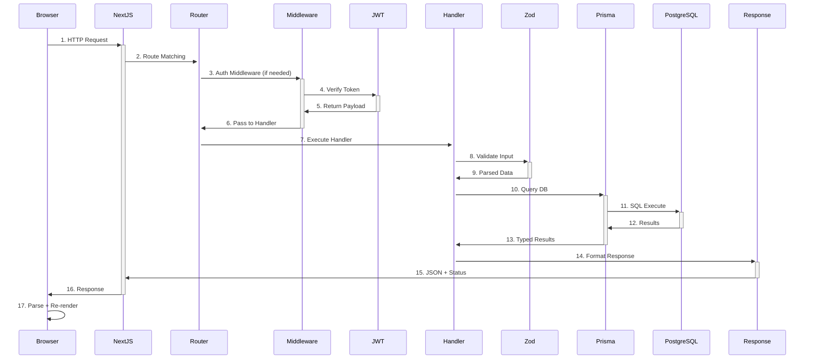

# 🏗️ ARQUITETURA TÉCNICA - SUBLIME

**Documento Técnico** | **25 maio 2026** | **v1.0**

---

## 📐 Visão Geral da Arquitetura



---

## 🎯 Stack em Camadas

```
┌────────────────────────────────────────┐
│          PRESENTATION LAYER             │
│  React 19 / Next.js App Router         │
│  CSS Modules / Context API              │
│  (Loja, Checkout, Admin Panel)         │
└─────────────┬──────────────────────────┘
              │
┌────────────────────────────────────────┐
│          API LAYER                      │
│  Next.js API Routes (25+ endpoints)    │
│  Zod Validation / JWT Auth              │
│  CORS / Error Handling                  │
└─────────────┬──────────────────────────┘
              │
┌────────────────────────────────────────┐
│          DATA LAYER                     │
│  Prisma ORM (Type-safe queries)        │
│  Database Migrations                    │
│  Connection Pooling (Neon)              │
└─────────────┬──────────────────────────┘
              │
┌────────────────────────────────────────┐
│       INFRASTRUCTURE LAYER               │
│  PostgreSQL 14+ (Neon)                  │
│  Cloudinary (Storage)                   │
│  OSM/ViaCEP (Geocoding)                │
│  Vercel (Deployment)                    │
└────────────────────────────────────────┘
```

---

## 🔄 Fluxo de Dados

### Request → Response Cycle



---

## 🗄️ Modelo de Dados (ER Diagram)

```
┌──────────────────────┐         ┌────────────────────────┐
│     USUARIO          │         │     CLIENTE            │
├──────────────────────┤         ├────────────────────────┤
│ PK: id               │         │ PK: id                 │
│ nome                 │         │ nome                   │
│ email (UNIQUE)       │         │ cpf (UNIQUE)           │
│ senha (HASH)         │         │ compras [] (REF PEDIDO)│
│ isAdmin              │         │ contato                │
│ permissoes (JSON)    │         └────────────────────────┘
│ ativo (DEFAULT true) │                    △
└──────────────────────┘                    │ (via CPF)
                                            │
        ┌───────────────────────────────────┘
        │
        │  1 Cliente : N Pedidos
        │
        ▼
┌──────────────────────────────────────────────┐
│           PEDIDO                              │
├──────────────────────────────────────────────┤
│ PK: id                                       │
│ idRastreio (UNIQUE) - VD-001234             │
│ nome (FK Cliente)                            │
│ cpf (FK Cliente)                             │
│ items: Json (Array de produtos)             │
│ endereco                                     │
│ totalVenda, subtotal, frete                 │
│ metodoPagamento: PIX|DINHEIRO|CREDITO       │
│ pagamento: PENDENTE|REALIZADO               │
│ etapa: RESERVADO|CONFIRMADO|...|ENTREGUE    │
│ cupom (FK Cupom)                             │
│ parcelas, trocoPara, valorALevar            │
│ dataCompra (TIMESTAMP)                      │
└──────────────────────────────────────────────┘
         △                        △
         │                        │ (applies)
         └────────────────┬───────┘
                          │
                ┌─────────┴────────┐
                │                  │
                ▼                  ▼
        ┌─────────────┐    ┌──────────────┐
        │   ESTOQUE   │    │    CUPOM     │
        ├─────────────┤    ├──────────────┤
        │ PK: id      │    │ PK: id       │
        │ qtd         │    │ cupom (UNIQUE)
        │ produto     │    │ desconto     │
        │ cores       │    │ qtdUsos      │
        │ litros      │    └──────────────┘
        │ valor       │
        │ linha       │
        │ imagem      │
        │ filtros     │
        └─────────────┘
```

---

## 🔐 Autenticação & Autorização

### JWT Flow

```
┌─────────────────────────────────────────────────────────────┐
│                      LOGIN PROCESS                           │
└─────────────────────────────────────────────────────────────┘

User Input: email + senha
    ↓
POST /api/auth/login (✅ Público)
    ├─ Parse JSON
    ├─ Validate com Zod
    └─ Search: findUnique(where: { email })
    ↓
User Found?
    ├─ YES: bcrypt.compare(senha, user.senha)
    │       ↓
    │       Senha correta?
    │       ├─ YES: Continue
    │       └─ NO: Return 401 "Senha incorreta"
    │
    └─ NO: Return 401 "Usuário não encontrado"
    ↓
Generate JWT with payload:
{
  id: number,
  nome: string,
  apelido: string,
  isAdmin: boolean,
  permissoes: {
    estoque: { ver, editar },
    pedidos: { ver, editar },
    cupons: { ver, editar },
    config: { ver, editar },
    usuarios: { ver, editar }
  }
}
    ↓
SignJWT({...})
    .setProtectedHeader({ alg: 'HS256' })
    .setIssuedAt()
    .setExpirationTime('7d')
    .sign(secret)
    ↓
Return: {
  token: "eyJhbGc...",
  usuario: { id, nome, apelido }
}
    ↓
Browser stores token (localStorage or cookie)
    ↓
┌─────────────────────────────────────────────────────────────┐
│               PROTECTED REQUEST PROCESS                      │
└─────────────────────────────────────────────────────────────┘

GET /api/estoque/[id] (🔒 Protegido)
    ├─ Extract: Authorization header
    ├─ Parse: Bearer <token>
    └─ Verify: verifyJwt(token)
    ↓
Middleware: autenticar(req)
    ├─ Check token válido (assinatura, expiracao)
    ├─ Extract payload
    └─ Attach req.usuario = payload
    ↓
Handler executa com req.usuario disponível
    ├─ Check: usuario.isAdmin?
    ├─ Check: usuario.permissoes[recurso][acao]?
    └─ Continue ou Return 403
    ↓
Response com Status 200/403/401
```

### Permission Matrix

```
              Estoque  Pedidos  Cupons   Config   Usuarios
Visitante        VER      VER      VER      -        -
Admin-Limited    VER     VER+ED    VER      -        -
Admin-Full      VER+ED  VER+ED   VER+ED  VER+ED   VER+ED
```

---

## 🛒 Checkout State Machine

```
                    START
                      │
                      ↓
            ┌─────────────────┐
            │  Carrinho Vazio? │
            └────┬──────┬──────┘
                 │      │
                 ✅ SIM  │ NÃO
                 │      ↓
                 │   ┌─────────────────┐
                 │   │ ETAPA 1: Dados  │
                 │   │ (Nome, Tel, CPF)│
                 │   └────┬────────────┘
                 │        │ Validado?
                 │        ✅ SIM
                 │        ↓
                 │   ┌──────────────────┐
                 │   │ ETAPA 2: Entrega │
                 │   │ (CEP, Retirada)  │
                 │   └────┬─────────────┘
                 │        │ Validado?
                 │        ✅ SIM (Frete Calc)
                 │        ↓
                 │   ┌──────────────────────┐
                 │   │ ETAPA 3: Pagamento   │
                 │   │ (PIX/Dinheiro/Cartão)│
                 │   └────┬────────────────┘
                 │        │ Validado?
                 │        ✅ SIM
                 │        ↓
                 │   ┌──────────────────────┐
                 │   │ ETAPA 4: Confirmação │
                 │   │ (Resumo + Cupom)     │
                 │   └────┬─────────────────┘
                 │        │ Confirmado?
                 │        ✅ SIM
                 │        ↓
                 │   ┌─────────────────────┐
                 │   │  CRIAR PEDIDO       │
                 │   │  Transação Atômica: │
                 │   │  ├─ Validar Estoque │
                 │   │  ├─ Decrementar Qty │
                 │   │  ├─ Gerar ID (VD-X) │
                 │   │  ├─ Criar Pedido    │
                 │   │  ├─ Consumir Cupom  │
                 │   │  └─ Atualizar Client│
                 │   └────┬────────────────┘
                 │        │ Sucesso?
                 │        ✅ SIM
                 │        ↓
                 │   ┌──────────────────────┐
                 │   │ SUCCESS MODAL        │
                 │   │ Mostra: ID, Data,    │
                 │   │ Total, CTA Rastrear  │
                 │   └────┬─────────────────┘
                 │        │
                 └────┬───┘
                      │
                      ↓
                  CARRINHO LIMPO
                      │
                      ↓
                  FIM / REDIRECT
```

---

## 💾 Data Flow - Pedido

```
┌──────────────────────────────────────────────────────────────┐
│                  PEDIDO CREATION FLOW                         │
└──────────────────────────────────────────────────────────────┘

Frontend: CartContext.items
    ├─ { id: 1, qtd: 2, valor: 49.90, ... }
    ├─ { id: 2, qtd: 1, valor: 79.90, ... }
    └─ Total Calculation:
        Subtotal = ∑(item.qtd × item.valor)
        Frete = tier[subtotal]
        Desconto = cupom ? desconto_value : 0
        Total = Subtotal + Frete - Desconto

    ↓ POST /api/pedidos

Backend: 
    1. Parse & Validate com Zod:
       - nome (string, min 3)
       - contato (phone format)
       - cpf? (mod 11 if provided)
       - items[] (non-empty)
       - metodoPagamento (enum)
    
    2. Atomic Transaction (Prisma):
       ├─ Check: ∀ item in items, estoque.qtd >= qtd
       │          If not → 400 "Stock insufficient"
       │
       ├─ Decrement Stock:
       │  UPDATE estoque SET qtd = qtd - ? WHERE id = ?
       │
       ├─ Generate ID:
       │  SELECT MAX(CAST(SUBSTRING(idRastreio, 4) AS INT)) + 1
       │  → VD-001235
       │
       ├─ Create Pedido:
       │  INSERT INTO pedido (...) VALUES (...)
       │
       ├─ Consume Cupom:
       │  IF cupom PROVIDED:
       │    UPDATE cupom SET quantidadeUsos = quantidadeUsos - 1
       │
       ├─ Upsert Cliente:
       │  IF CPF:
       │    UPDATE cliente SET compras = [..., VD-001235]
       │           WHERE cpf = ?
       │    ELSE CREATE cliente
       │
       └─ Return: { idRastreio, totalVenda, message }

    3. Transação Falha?
       → Rollback automático (tudo ou nada)
       → 500 "Erro ao processar pedido"

Frontend: Success Modal
    ├─ Display: ID, Date, Total
    ├─ Clear: CartContext
    ├─ Save localStorage (para persistência)
    └─ CTA: "Rastrear" → /compras?id=VD-001235
```

---

## 🌐 Request Lifecycle



---

## 🧠 State Management

### CartContext Redux-Like

```javascript
// Action Types
const ACTIONS = {
  LOAD: 'LOAD',           // Init from localStorage
  ADD: 'ADD',             // Add/increment item
  REMOVE: 'REMOVE',       // Remove completely
  UPDATE_QTY: 'UPDATE_QTY', // Change quantity
  CLEAR: 'CLEAR',         // Empty cart
  TOGGLE_SIDEBAR: 'TOGGLE_SIDEBAR',
  CLOSE_SIDEBAR: 'CLOSE_SIDEBAR'
}

// State Structure
const initialState = {
  items: [
    {
      id: number,              // Product ID
      descricao: string,
      cores: string,           // Selected color
      imagem: string,
      capacidade: string,      // litros
      quantidade: number,      // Qty in cart
      valor: number,           // Price per unit
      valorOriginal: number
    }
  ],
  sidebarOpen: boolean,
  error: null | string
}

// Reducer Pattern
function reducer(state, action) {
  switch(action.type) {
    case 'ADD':
      // Find item by id+cores+capacidade
      // If exists: increment qty
      // Else: add new item
      // Save to localStorage
      
    case 'REMOVE':
      // Filter out item by id
      // Save to localStorage
      
    case 'UPDATE_QTY':
      // Find item, update qty
      // If qty <= 0: remove
      // Save to localStorage
      
    case 'CLEAR':
      // Return empty state
      // Clear localStorage
  }
}

// Persistence Effect
useEffect(() => {
  // Auto-save to localStorage
  localStorage.setItem('sublime_cart', JSON.stringify(state.items))
}, [state.items])

useEffect(() => {
  // Load from localStorage on mount
  const saved = localStorage.getItem('sublime_cart')
  if (saved) dispatch({ type: 'LOAD', payload: JSON.parse(saved) })
}, [])

// Public Hook
export const useCart = () => {
  const { state, dispatch } = useContext(CartContext)
  
  return {
    items: state.items,
    isEmpty: state.items.length === 0,
    totalItems: state.items.reduce((sum, item) => sum + item.quantidade, 0),
    totalPrice: state.items.reduce((sum, item) => sum + (item.valor * item.quantidade), 0),
    error: state.error,
    sidebarOpen: state.sidebarOpen,
    
    // Dispatch wrappers
    add: (item) => dispatch({ type: 'ADD', payload: item }),
    remove: (itemId) => dispatch({ type: 'REMOVE', payload: itemId }),
    updateQty: (itemId, qty) => dispatch({ type: 'UPDATE_QTY', payload: { itemId, qty } }),
    clear: () => dispatch({ type: 'CLEAR' }),
    toggleSidebar: () => dispatch({ type: 'TOGGLE_SIDEBAR' }),
    closeSidebar: () => dispatch({ type: 'CLOSE_SIDEBAR' })
  }
}
```

---

## 🔌 API Versioning & Deprecation

**Current**: `v1` (no prefix)
**Future**: `/api/v2/...`

```
GET /api/estoque                    // v1 (current)
GET /api/v1/estoque                 // v1 (explicit, future)
GET /api/v2/estoque?page=1&limit=20 // v2 (future with pagination)

// Deprecation Timeline:
2026-05-25: v1 Released
2026-11-25: v2 Beta (v1 still supported)
2027-05-25: v2 GA (v1 deprecated, sunset warning in responses)
2027-11-25: v1 Removed
```

---

## 📊 Database Indexing Strategy

```sql
-- Performance Critical Queries
CREATE INDEX idx_estoque_linha ON estoque(linha);
CREATE INDEX idx_estoque_produto ON estoque(produto);

CREATE INDEX idx_pedido_cpf ON pedido(cpf);
CREATE INDEX idx_pedido_idRastreio ON pedido(idRastreio);
CREATE INDEX idx_pedido_dataCompra ON pedido(dataCompra);

CREATE INDEX idx_cliente_cpf ON cliente(cpf);
CREATE INDEX idx_cupom_cupom ON cupom(cupom);
CREATE INDEX idx_usuario_email ON usuario(email);

-- Composite Index for Common Filters
CREATE INDEX idx_estoque_linha_valor ON estoque(linha, valor);
```

---

## 🚀 Deployment Architecture

```
┌─────────────────────────────────────────────────────────┐
│                   VERCEL (Production)                    │
├─────────────────────────────────────────────────────────┤
│  Auto-scaling Edge Network (90+ regions worldwide)       │
│  ├─ Next.js App: Auto-optimized & cached                │
│  ├─ API Routes: Serverless functions (~100ms cold start)│
│  ├─ Static Files: Cached globally (CSR + SSG)          │
│  └─ Environment Variables: Encrypted at rest            │
└─────────┬───────────────────────────────────────────────┘
          │ HTTPS (TLS 1.3)
          │
┌─────────┴───────────────────────────────────────────────┐
│                  NEON (Database)                         │
├─────────────────────────────────────────────────────────┤
│  PostgreSQL 14+ Serverless                              │
│  ├─ Branching (dev/staging/prod)                        │
│  ├─ Auto-scaling compute                                │
│  ├─ Connection pooling (PgBouncer)                       │
│  ├─ 99.95% uptime SLA                                    │
│  └─ Point-in-time recovery (28 days)                    │
└─────────┬───────────────────────────────────────────────┘
          │
┌─────────┴───────────────────────────────────────────────┐
│              CLOUDINARY (Storage)                        │
├─────────────────────────────────────────────────────────┤
│  CDN + Image Optimization                               │
│  ├─ 25GB free storage tier                              │
│  ├─ Auto WebP/AVIF conversion                           │
│  ├─ Real-time transformations                           │
│  └─ HTTPS delivery (fast & secure)                      │
└─────────────────────────────────────────────────────────┘
```

---

## 🔄 CI/CD Pipeline

```
GitHub Push (main branch)
    │
    ↓
┌─────────────────────┐
│  GitHub Actions     │
│  ├─ npm install     │
│  ├─ npm run build   │
│  ├─ npm run test    │
│  └─ Checks pass?    │
    │
    YES ↓
    │
    ├─ Deploy preview (auto)
    └─ Production deploy (manual)
         │
         ↓
    Vercel Builds
         │
         ├─ Prism ORM generate
         ├─ TypeScript compile
         ├─ Next.js build
         ├─ Database migrations
         └─ Deploy to edge
         │
         ↓
    ✅ Live at https://sublime.com.br
```

---

## 🏥 Monitoring & Observability

**Recommended Setup**:

```
┌──────────────────┐
│  Application     │
│  ├─ Vercel       │ → Monitor: CPU, Memory, Response times
│  ├─ Database     │ → Monitor: Connection pool, Slow queries
│  └─ Integrations │ → Monitor: Cloudinary, ViaCEP uptime
└──────────────────┘
         │
         ↓
┌──────────────────┐
│  Logging         │
│  ├─ Vercel Logs  │
│  ├─ Sentry       │
│  └─ DataDog      │
└──────────────────┘
         │
         ↓
┌──────────────────┐
│  Alerts          │
│  ├─ Slack        │
│  ├─ Email        │
│  └─ PagerDuty    │
└──────────────────┘
```

---

## 🎯 Performance Metrics

### Targets

| Métrica | Target | Status |
|---------|--------|--------|
| **Largest Contentful Paint (LCP)** | < 2.5s | ✅ |
| **First Input Delay (FID)** | < 100ms | ✅ |
| **Cumulative Layout Shift (CLS)** | < 0.1 | ✅ |
| **Time to First Byte (TTFB)** | < 600ms | ✅ |
| **API Response Time** | < 200ms | ✅ |
| **Database Query** | < 50ms | ✅ |
| **Lighthouse Score** | > 90 | 🚀 |

### Optimization Techniques

```javascript
// 1. Next.js Image Optimization
<Image src={url} width={200} height={200} priority={false} />

// 2. Code Splitting
const CartSidebar = dynamic(() => import('./CartSidebar'), {
  loading: () => <Skeleton />
})

// 3. Server Component Rendering
// app/page.jsx - Server Component by default
export default async function Page() {
  const products = await getProducts() // Server-side fetch
  return <ProductGrid items={products} />
}

// 4. Database Query Optimization
const products = await prisma.estoque.findMany({
  select: { id, produto, valor, imagem }, // Fewer columns
  take: 20  // Limit results
})

// 5. API Caching
const products = unstable_cache(
  () => prisma.estoque.findMany(),
  ['products'],
  { revalidate: 3600 }  // 1 hour cache
)
```

---

## 🧪 Testing Strategy

```
Unit Tests
├─ Utility functions (lib/*.js)
├─ Validation logic (Zod schemas)
└─ Component logic

Integration Tests
├─ API endpoints (with mocked DB)
├─ Auth flow
└─ Payment processing

E2E Tests
├─ Complete checkout flow
├─ Admin workflows
└─ Edge cases
```

---

## 🔐 Security Architecture

```
┌─────────────────┐
│  HTTPS/TLS 1.3  │ ← Encrypted transport
└────────┬────────┘
         │
┌────────┴────────────────────────┐
│  Request Validation             │
│  ├─ CORS whitelist              │
│  ├─ Rate limiting               │
│  ├─ Zod schema validation       │
│  └─ Input sanitization          │
└────────┬────────────────────────┘
         │
┌────────┴────────────────────────┐
│  Authentication                 │
│  ├─ JWT verification (jose)     │
│  ├─ Token expiration (7 days)   │
│  └─ HttpOnly cookies            │
└────────┬────────────────────────┘
         │
┌────────┴────────────────────────┐
│  Authorization                  │
│  ├─ isAdmin check               │
│  ├─ Permission matrix           │
│  └─ Resource ownership          │
└────────┬────────────────────────┘
         │
┌────────┴────────────────────────┐
│  Data Security                  │
│  ├─ Bcrypt password hashing     │
│  ├─ SQL injection prevention    │
│  │  (Prisma parameterized)      │
│  └─ Secrets management          │
└────────┬────────────────────────┘
         │
┌────────┴────────────────────────┐
│  Response Security              │
│  ├─ No sensitive data in logs   │
│  ├─ CSP headers                 │
│  ├─ X-Frame-Options             │
│  └─ X-Content-Type-Options      │
└─────────────────────────────────┘
```

---

## 📈 Scalability Plan

### Current Setup (MVP)

- **Users**: 0-1,000 concurrent
- **Requests**: 0-1,000 req/sec
- **Storage**: < 25GB (Cloudinary free)
- **Database**: Neon free tier

### Phase 2 (1k-10k users)

- **Upgrade**: Neon Pro ($500/mo)
- **CDN**: Add edge caching layer
- **Database**: Switch to dedicated PostgreSQL or RDS
- **API**: Add response caching with Redis

### Phase 3 (10k+ users)

- **Database**: Read replicas + sharding
- **Cache**: Redis for frequently accessed data
- **Search**: Elasticsearch for product search
- **Analytics**: BigQuery for insights

---

## 🗺️ Roadmap & Future

```
Q2 2026 (MVP - Current)
├─ Core e-commerce functionality ✅
├─ Admin panel ✅
├─ Payment methods ✅
└─ Rastreamento ✅

Q3 2026 (Polish & Scale)
├─ Webhooks for notifications
├─ Analytics dashboard
├─ Performance optimization
└─ Mobile app (React Native)

Q4 2026 (Advanced Features)
├─ Wishlist/Reviews
├─ Loyalty program
├─ AI recommendations
└─ Marketplace (3rd party sellers)

2027 (Enterprise)
├─ White-label solution
├─ B2B portal
├─ Multi-currency support
└─ Advanced reporting
```

---

## 🎓 Architecture Decision Records (ADRs)

### ADR-001: Why Next.js?

**Decision**: Use Next.js 15+ with App Router

**Rationale**:
- ✅ Server & client rendering in one framework
- ✅ Built-in API routes (no separate backend)
- ✅ Type-safe with TypeScript
- ✅ Optimized for Web Vitals
- ✅ Great DX and community

**Alternatives Considered**:
- Express.js (Too low-level, need React separately)
- Remix (Good, but Next.js more battle-tested)
- Django/Flask (Different ecosystem, harder hiring)

---

### ADR-002: Why Prisma ORM?

**Decision**: Use Prisma over raw SQL

**Rationale**:
- ✅ Type-safe queries (TypeScript intellisense)
- ✅ Migrations built-in
- ✅ Easy to switch databases (PostgreSQL → MongoDB)
- ✅ Atomic transactions with $transaction
- ✅ Great developer experience

**Alternatives Considered**:
- TypeORM (Complex setup, overkill for MVP)
- Sequelize (Less modern, more verbose)
- Raw SQL (Type-unsafe, error-prone)

---

### ADR-003: Why JWT over Sessions?

**Decision**: Use JWT for stateless auth

**Rationale**:
- ✅ Scalable (no server-side session storage)
- ✅ Works with edge functions/serverless
- ✅ Self-contained (client verifies signature)
- ✅ Easy to implement
- ✅ Industry standard

**Alternatives Considered**:
- Session cookies (Requires shared session storage)
- OAuth2 (Overkill for internal admin auth)

---

## 📚 Resources & References

- **Architecture Patterns**: [Microservices Patterns](https://microservices.io/)
- **Database Design**: [PostgreSQL Best Practices](https://www.postgresql.org/docs/)
- **API Design**: [REST API Best Practices](https://restfulapi.net/)
- **Security**: [OWASP Top 10](https://owasp.org/www-project-top-ten/)
- **Performance**: [Web.dev Vitals](https://web.dev/vitals/)

---

**Documento Técnico** | **v1.0** | **25 maio 2026**
